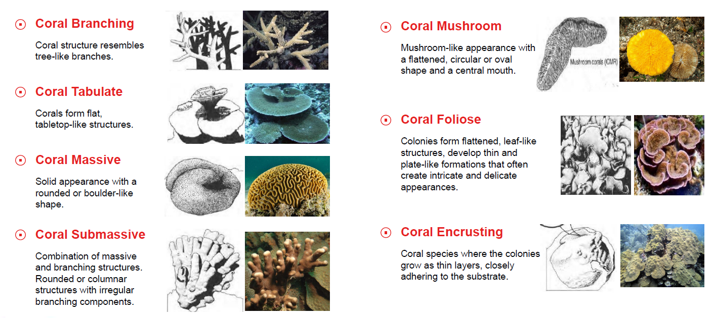
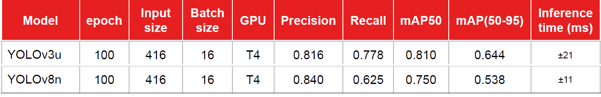
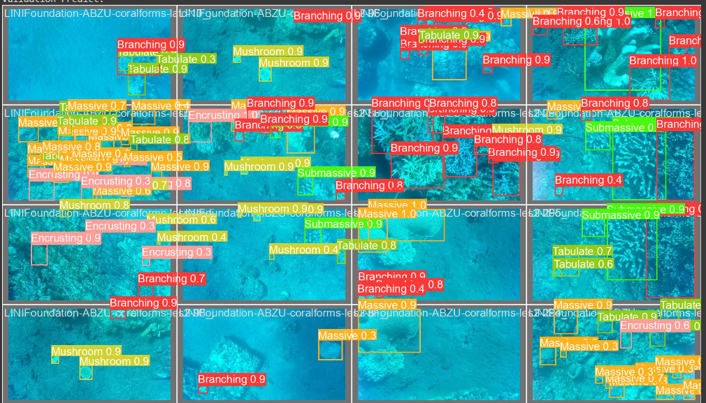
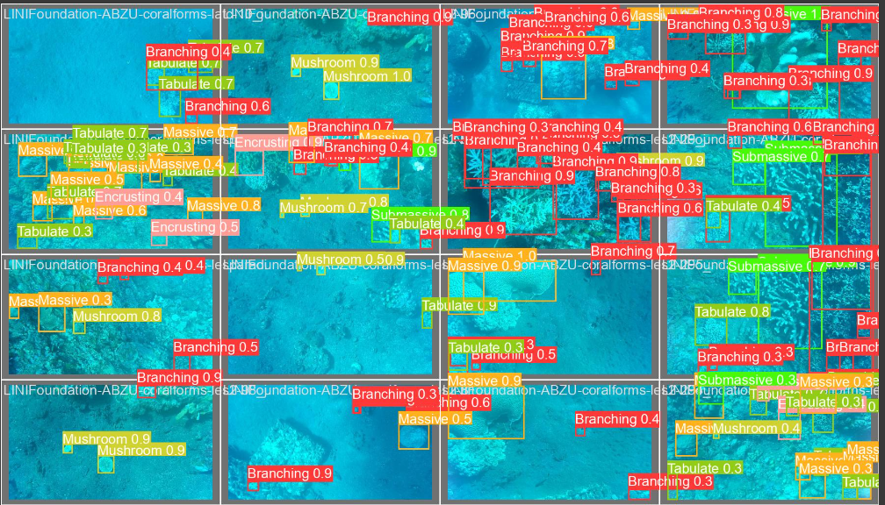

# Final Project
This is a group final project in Bootcamp Indonesia AI Computer Vision Batch 3. Our group choose object detection for Coral Life Form Detection

## Our group member:
1. **Hendra Ronaldi** (me)
2. Fathurrahman Hernanda Khasan
3. Fitrah Ramadhan Reza
4. Harrison
5. Hilmy Rahmadani
6. I Putu Ananta Yogiswara
7. Satriaji Najha Darmawan
8. Tri Wahyu Prabowo
9. Yurixa Sakhinatul Putri
10. Nadya Novalina

## Project Overview
- Coral reefs, often referred to as the "rainforests of the sea," are some of the most diverse ecosystems in the world. Thousands of species
rely on reefs for survival. Millions of people all over the world also depend on coral reefs for food, protection and jobs. Unfortunately, these
vital ecosystems are facing unprecedented threats due to climate change.
- National Oceanic and Atmospheric Administration (NOAA) stated that climate change will affect coral reef ecosystems, through sea level
rise, changes to the frequency and intensity of tropical storms, and altered ocean circulation patterns. When combined, all of these impacts
dramatically alter ecosystem function, as well as the goods and services coral reef ecosystems provide to people around the globe.
- Traditional methods of coral assessment, such as Line Intercept Transect (LIT) for identifying coral coverage, often face limitations in terms
of scope and efficiency. These limitations are particularly evident in survey scalability and the constraints of human diving time. To bridge
this gap, our project is dedicated to the utilization of automatic Coral Life Forms Detection for conducting a comprehensive analysis of coral
coverage during site surveys by an underwater robot.
- By integrating cutting-edge detection techniques into an automated coral monitoring method using an underwater robot, our objective is to
offer a more nuanced understanding of how climate change impacts various coral species, their distribution, and overall reef dynamics. This
endeavor aims to empower researchers and conservationists to make decisions about further interventions more efficiently.

#### Objectives
Develop deep learning models for identifying and analyzing
coral life forms, focusing on seven main forms (Branching,
Massive, Submassive, Foliose, Mushroom, Tabulate,
Encrusting).
#### Scope
Explore YOLO state of the art object detection algorithm in
developing deep learning model for coral life forms detection.

For this project we do a group research on YOLO variation, my part are YOLOv3u and YOLOv8n
1. YOLOv3u ([Hendra Ronaldi](./personal/Hendra_Final_Project_Coral_Object_Detection_YOLOv3u.ipynb))
2. YOLOv8n ([Hendra Ronaldi](./personal/Hendra_Final_Project_Coral_Object_Detection_YOLOv8n.ipynb))

Notes: 
For the team presentation result can be seen [here](./team/CVBD_Final_Project_Coral_Life_Forms_Detection.pdf).

## Dataset
Dataset [Coral Life Forms Detection](https://universe.roboflow.com/computer-vision-xiyu1/coral-life-forms-detection/dataset/3) used in this project. The dataset contains 264 train images, 33 validation images and 33 test images augmented to be 791 train images, 33 validation images, and 33 test images. For this project the dataset contains 7 classes as shown below.

## Experiment Results (YOLOv3u and YOLOv8n)

**Example predictions**

**YOLOv3u**

**YOLOv8n**

## Dependencies

This project requires **Python 3** and the following Python libraries installed:

* Basic Libraries: [NumPy](http://www.numpy.org/), [Matplotlib](http://matplotlib.org/), [Pandas](https://pandas.pydata.org/)
* Deep-learning Frameworks: [PyTorch](https://pytorch.org/), [Ultralytics](https://docs.ultralytics.com/)

📨 That's all, for any discussion kindly contact me here: hendraronaldi10@gmail.com
