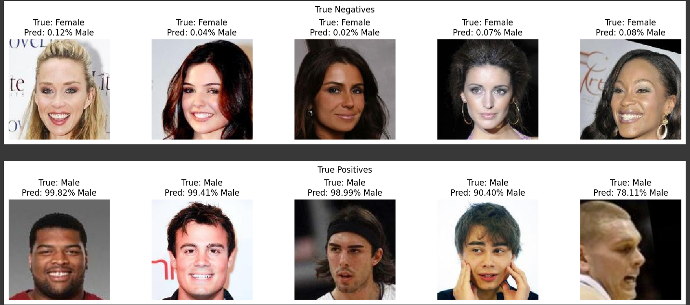

# Project 1 Face Recognition Gender Classification 
This is a group project 1 in Bootcamp Indonesia AI Computer Vision Batch 3

## Our group member:
1. **Hendra Ronaldi** (me)
2. Fathurrahman Hernanda Khasan
3. Fitrah Ramadhan Reza
4. Harrison
5. Hilmy Rahmadani
6. I Putu Ananta Yogiswara

## Project Overview
Face recognition for gender classification can be a good application to be used on security, customer demography, customer experiences, etc. This application can identify gender based on face automaticaly.

For this project we do a group research on 3 suggested models as follows
1. [VGG](https://github.com/hendraronaldi/machine_learning_projects/blob/main/Bootcamp%20Computer%20Vision%20Indonesia%20AI%20Batch%203/Project%201%20Face%20Recognition/notebooks/VGG16_VGG19.ipynb) (**Hendra Ronaldi** & **Fathurrahman Hernanda Khasan**)
2. [GoogLeNet](https://github.com/hendraronaldi/machine_learning_projects/blob/main/Bootcamp%20Computer%20Vision%20Indonesia%20AI%20Batch%203/Project%201%20Face%20Recognition/notebooks/GoogleNet.ipynb) (**Hilmy Rahmadani** & **I Putu Ananta Yogiswara**)
3. [Resnet](https://github.com/hendraronaldi/machine_learning_projects/blob/main/Bootcamp%20Computer%20Vision%20Indonesia%20AI%20Batch%203/Project%201%20Face%20Recognition/notebooks/ResNet50.ipynb) (**Fitrah Ramadhan Reza** & **Harrison**)

Notes: 
`This repository will be focused on research on VGG model because of my part`

## Dataset
Dataset [CelebA](https://mmlab.ie.cuhk.edu.hk/projects/CelebA.html) used in this project. It was sampled down and provided by the bootcamp to be consists of **5000** face images. The attribute information of the images can be seen [here](https://www.kaggle.com/datasets/jessicali9530/celeba-dataset/?select=list_attr_celeba.csv), we use the column `Male` as target for this project (`-1` as `Female` and `1` as `Male`)

## Experiment Results (VGG)
2 models VGG16 and VGG19 used for experiment on test dataset
1. VGG16 achieve **92.48%** accuracy with weight size model **105 MB**
2. VGG19 achieve **92.28%** accuracy with weight size model **125 MB**

Example predictions

Though this model still have lower accuracy compare to other models, both models still give good predictions (> 90% accuracy)

## Dependencies

This project requires **Python 3** and the following Python libraries installed:

* Basic Libraries: [NumPy](http://www.numpy.org/), [Matplotlib](http://matplotlib.org/), [Pandas](https://pandas.pydata.org/)
* Deep-learning Frameworks: [TensorFlow](https://www.tensorflow.org/)
* Experiment Tracking Tools: [Wandb](https://wandb.ai/site)

📨 That's all, for any discussion kindly contact me here: hendraronaldi10@gmail.com
