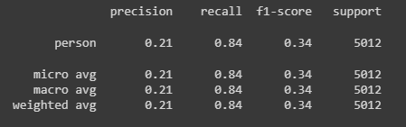
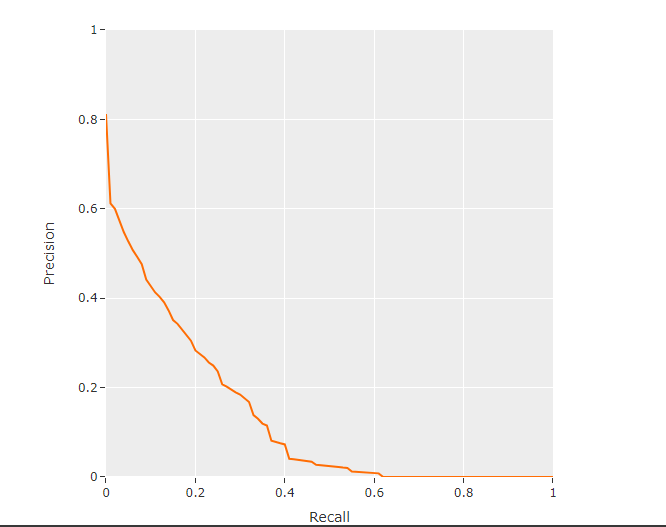
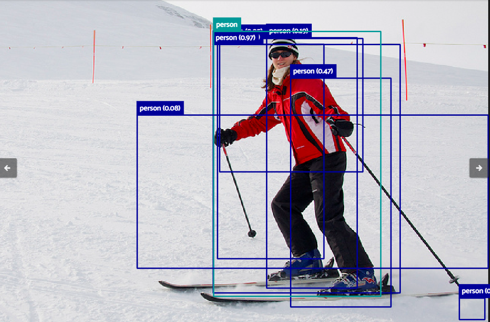
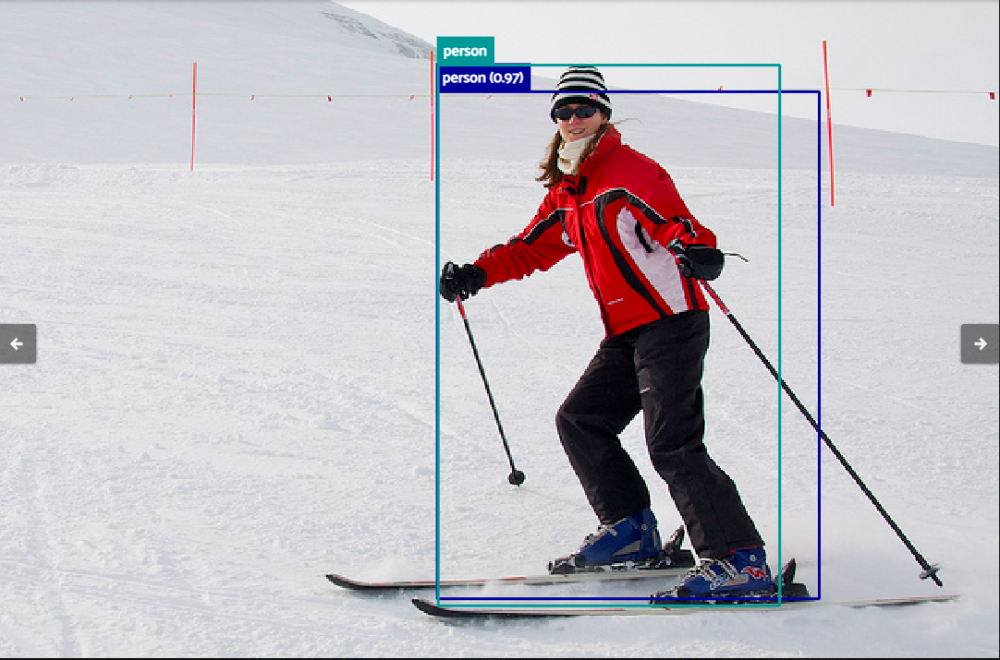

# Project 2 Person Detection 
This is a group project for object detection topic in Bootcamp Indonesia AI Computer Vision Batch 3

## Our group member:
1. **Hendra Ronaldi** (me)
2. Fathurrahman Hernanda Khasan
3. Fitrah Ramadhan Reza
4. Harrison
5. Hilmy Rahmadani
6. I Putu Ananta Yogiswara
7. Satriaji Najha Darmawan
8. Tri Wahyu Prabowo
9. Yurixa Sakhinatul Putri
10. Nadya Novalina

## Project Overview
Person Detection can be a good application to be used on security, traffic system, also in retail.

For this project we do a group research on 2 main algorithm models (Faster R-CNN and YOLO) with variations as follows
1. Faster R-CNN GoogLeNet ([Hendra Ronaldi](./personal/Hendra_Project_2_Person_Tracking_(Faster_R_CNN_GoogLeNet).ipynb) & [Hilmy Rahmadani](./team/Dani_project2_person_tracking_fasterrcnn_googlenet.ipynb))
2. [Faster R-CNN MobileNet](./team/fathurrahman_Mobile_net.ipynb) (**Fathurrahman Hernanda Khasan** & **Fitrah Ramadhan Reza**)
3. Faster R-CNN ResNet50 ([I Putu Ananta Yogiswara](./team/putu_ananta_fasterrcnn_resnet50.ipynb) & [Harrison](./team/Harrison_fasterrcnn_rasnet50.ipynb))
4. YOLO v3 ([Satriaji Najha Darmawan](./team/Satriaji_PersonDetection_trainingYOLOv3.ipynb) & [Tri Wahyu Prabowo](./team/triwahyu_yolov5_yolov3_coco_persontracking.ipynb))
5. [YOLO v5](./team/triwahyu_yolov5_yolov3_coco_persontracking.ipynb) (**Tri Wahyu Prabowo** & **Yurixa Sakhinatul Putri**)
6. [YOLO v8](./team/Satriaji_PersonDetection_trainingYOLOv8.ipynb) (**Satriaji Najha Darmawan** & **Nadya Novalina**)

Notes: 
`This repository will be focused on research on Faster R-CNN GoogLeNet model`. For the team presentation result can be seen [here](./team/Project_2_Presentation.pdf) along with the [timeline](./team/Timeline_CVB+D_Project_2.xlsx).

## Dataset
Dataset [COCO-2017](https://docs.voxel51.com/user_guide/dataset_zoo/datasets.html#dataset-zoo-coco-2017) from FiftyOne used in this project. It was sampled down to **5000** data (**4000** train, **500** validation, and **500** test). The information of the dataset can be seen [here](https://cocodataset.org/#home). For this project we use `person` class only in detections.

## Experiment Results (Faster R-CNN GoogLeNet)
2 backbone Faster R-CNN GoogLeNet (Inception v1) and Inception v3 used for experiment on test dataset
1. Inception v1 achieve **0.088** mAP
2. Inception v3 achieve **0.133** mAP

The experiments on Faster R-CNN using these 2 backbones were not achieve good result with very low mAP, tends to predict multiple detection on single ground-truth detections, also took very long time training with 2 to 2.5 hours approximately for only 5 epochs.

Classification Report

PR Curve

**Example predictions Inception v3**

No Threshold

0.5 Confidence Threshold

## Dependencies

This project requires **Python 3** and the following Python libraries installed:

* Basic Libraries: [NumPy](http://www.numpy.org/), [Matplotlib](http://matplotlib.org/), [Pandas](https://pandas.pydata.org/)
* Deep-learning Frameworks: [PyTorch](https://pytorch.org/), [Ultralytics](https://docs.ultralytics.com/)

📨 That's all, for any discussion kindly contact me here: hendraronaldi10@gmail.com
