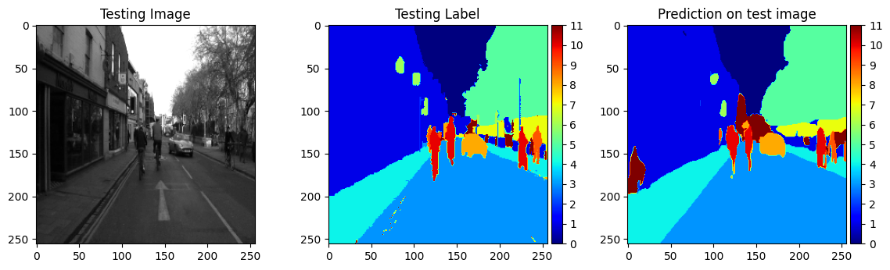

# Project 3 Self Driving Car
This is a group project for semantic segmentation topic in Bootcamp Indonesia AI Computer Vision Batch 3

## Our group member:
1. **Hendra Ronaldi** (me)
2. Fathurrahman Hernanda Khasan
3. Fitrah Ramadhan Reza
4. Harrison
5. Hilmy Rahmadani
6. I Putu Ananta Yogiswara
7. Satriaji Najha Darmawan
8. Tri Wahyu Prabowo
9. Yurixa Sakhinatul Putri
10. Nadya Novalina

## Project Overview
In the era of the automotive revolution, the development of autonomous technology has become a primary focus, bringing forth a vision of the future filled with innovation and progress. One key element that enables autonomous vehicles to operate safely and efficiently is their ability to understand their environment in high detail. In this regard, semantic segmentation techniques become essential.

Semantic segmentation is a technique in image processing that allows the recognition of objects and the separation of pixels in an image into specific categories or classes. In the context of autonomous vehicles, this technique serves as a fundamental basis for understanding road contours, vehicles, pedestrians, and other objects in their surroundings.

For this project we do a group research on 2 main algorithm models (U-Net and FCN8) with variations as follows
1. U-Net ResNet ([Hendra Ronaldi](./personal/Hendra_Project_3_Cityscapes_Semantic_Segmentation.ipynb))
2. FCN8 ResNet (**I Putu Ananta Yogiswara** & **Harrison**)

Notes: 
`This repository will be focused on research on U-Net ResNet model`. For the team presentation result can be seen [here](./team/CVBD_Project_3_Self_Driving_Car_Presentation.pdf) along with the [timeline](./team/Timeline_CVBD_Project_3.xlsx).

## Dataset
Dataset [cityscapes-dataset](https://www.cityscapes-dataset.com/) used in this project. It was sampled down provided by bootcamp to **367** data train and **101** data test. For this project the dataset contains 12 classes without name provided for each class (labeled 0,1,2,3,4,5,6,7,8,9,10,11).

## Experiment Results (U-Net ResNet)
Detailed Notebook for this project can be found [here](./personal/Hendra_Project_3_Cityscapes_Semantic_Segmentation.ipynb)

Using ResNet50 as backbone in U-Net architecture gives
1. DiceLoss = 0.2642
2. MeanIoU = 0.6343

with detailed IoU for each class
1. IoU for class 0 is: 0.93580
2. IoU for class 1 is: 0.83939
3. IoU for class 2 is: 0.09443
4. IoU for class 3 is: 0.96363
5. IoU for class 4 is: 0.88002
6. IoU for class 5 is: 0.89554
7. IoU for class 6 is: 0.42939
8. IoU for class 7 is: 0.58789
9. IoU for class 8 is: 0.67694
10. IoU for class 9 is: 0.44786
11. IoU for class 10 is: 0.60319
12. IoU for class 11 is: 0.25796

The experiments on U-Net ResNet in some classes (2, 6, 9, 10, 12) relatively have low IoU while on other classes are relavitely high IoU. Looking at the sample prediction below, the model seems to have a harder prediction on small objects.

**Example predictions**

Example video prediction from test data can be found [here](./assets/test_video.mp4)

## Dependencies

This project requires **Python 3** and the following Python libraries installed:

* Basic Libraries: [NumPy](http://www.numpy.org/), [Matplotlib](http://matplotlib.org/), [Pandas](https://pandas.pydata.org/)
* Deep-learning Frameworks: [Tensorflow](https://www.tensorflow.org/), [Segmentation Models](https://github.com/qubvel/segmentation_models)

📨 That's all, for any discussion kindly contact me here: hendraronaldi10@gmail.com
