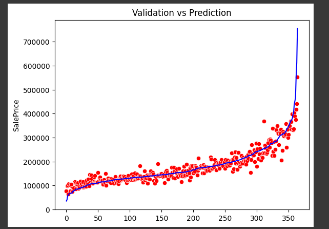
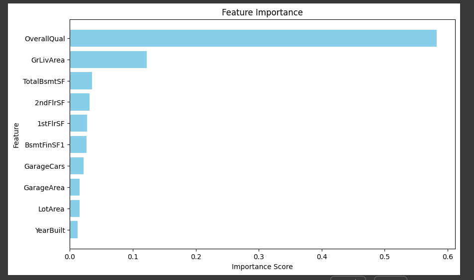
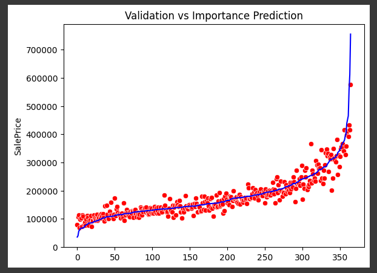

# Weekly Assignment 1
This is a group weekly assignment in Bootcamp Indonesia AI Computer Vision Batch 3

## Our group member:
1. **Hendra Ronaldi** (me)
2. Fathurrahman Hernanda Khasan
3. Fitrah Ramadhan Reza
4. Harrison
5. Hilmy Rahmadani
6. I Putu Ananta Yogiswara

## Project Overview
The Real Estate industry in Indonesia is experiencing rapid growth, especially in urban areas, with residential and commercial projects continuing to develop.

A system capable of determining house prices is crucial in the Real Estate industry as it assists sellers, buyers, and investors in making more informed and accurate decisions, avoiding overpricing or underpricing, and improving market efficiency.

## Dataset
It's a regression problem with dataset [AMES Housing Data](./dataset/) used in this project. 

## Experiment Results
Detailed Notebook for this project can be found [here]([Notebook](./CVB_Bootcamp_IndonesiaForAI_Weekly_Assignment_1.ipynb))

Using grid search cross validation to optimize result on random forest model, here is the result on validation dataset
1. Full feature: `RMSE = 27658.04`. This means for dataset price in range `10,000` to `40,000` there will be error `±27658.04`

2. Feature importance: `RMSE = 28512.214`

## Conclusion
- `OverallQual`: Rates the overall material and finish of thehouse menjadi fitur yang paling penting dalam prediksiSalePrice
- `GrLivArea`: Above grade (ground) living area square feetjuga menjadi fitur yang penting dalam prediksi SalePrice

## Dependencies
This project requires **Python 3** and the following Python libraries installed:

* Basic Libraries: [NumPy](http://www.numpy.org/), [Matplotlib](http://matplotlib.org/), [Pandas](https://pandas.pydata.org/), [Scikit-learn](https://scikit-learn.org/stable/)

📨 That's all, for any discussion kindly contact me here: hendraronaldi10@gmail.com
