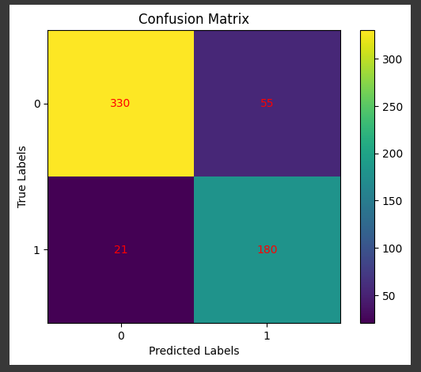
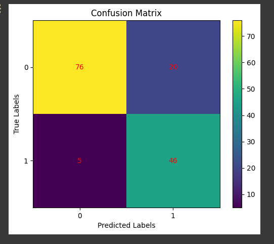
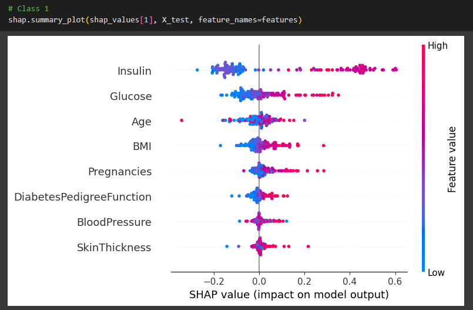

# Weekly Assignment 2
This is a group weekly assignment in Bootcamp Indonesia AI Computer Vision Batch 3

## Our group member:
1. **Hendra Ronaldi** (me)
2. Fathurrahman Hernanda Khasan
3. Fitrah Ramadhan Reza
4. Harrison
5. Hilmy Rahmadani
6. I Putu Ananta Yogiswara

## Project Overview
Diabetes is a serious disease that affects public health. Traditional methods of diagnosing diabetes require significant time and cost. ANN is a computational model effective in predicting diseases. ANN can process patient data, including risk factors, for accurate predictions. ANN has the potential to enhance diabetes prevention and management.

For this project we do a group research on artificial neural network for diagnosing diabetes

## Dataset
Dataset [pima indians diabetes](https://www.kaggle.com/datasets/uciml/pima-indians-diabetes-database) used in this project. 

It's a binary classification problem predicting field `Outcome` based on features, `1` is diabetes while `0` is not diabetes

Features

- `Pregnancies` Number of times pregnant
- `Glucose` Plasma glucose concentration a 2 hours in an oral glucose tolerance test
- `BloodPressure` Diastolic blood pressure (mm Hg)
- `SkinThickness` Triceps skin fold thickness (mm)
- `Insulin` 2-Hour serum insulin (mu U/ml)
- `BMI` Body mass index (weight in kg/(height in m)^2)
- `DiabetesPedigreeFunction` Diabetes pedigree function
- `Age` Age (years)

## Experiment Results
Detailed Notebook for this project can be found [here]([Notebook](./CVB_Bootcamp_IndonesiaForAI_Weekly_Assignment_2.ipynb))

Using bayesian optimizer to optimize result by auto tuning hyperparameter and ANN structure, here is the result
1. train loss: 0.2248 - f1_metric: 0.8032 - precision: 0.8711 - recall: 0.8408 - accuracy: 0.9027

2. test loss: 0.5395 - f1_metric: 0.7866 - precision: 0.6970 - recall: 0.9020 - accuracy: 0.8299

## Conclusion

- `Insulin` and `Glucose` are 2 most importance features
- the higher value of `Insulin`, `Glucose`, `Age`, `BMI` and `- ` tends to diagnosed as diabetes
With recall `0.9020` and precision `0.6970` in test dataset, it means that the model is better in preventing wrong diagnose of diabetes patient as non diabetes but not that good in preventing wrong diagnose of non diabetes as diabetes patient. It leads to better use the model as pre screening the potential diabetes patient but needs to do further examination to ensure diagnosis of diabetes is real or not
- To improve performance, because dataset only contains 768 rows it's better to collect more data and cleaner data (e.g. Insulin has many missing values)

## Dependencies

This project requires **Python 3** and the following Python libraries installed:

* Basic Libraries: [NumPy](http://www.numpy.org/), [Matplotlib](http://matplotlib.org/), [Pandas](https://pandas.pydata.org/)
* Deep-learning Frameworks: [Tensorflow](https://www.tensorflow.org/)

📨 That's all, for any discussion kindly contact me here: hendraronaldi10@gmail.com
